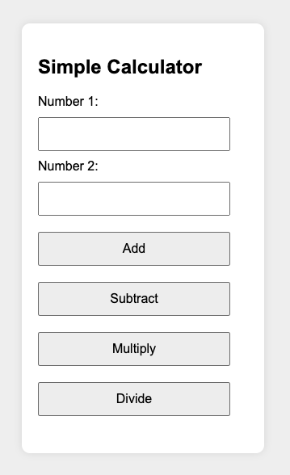

# Calculator Testing Project



## Description  
A modular calculator implementation with comprehensive test coverage using Jest. Supports basic arithmetic operations with robust error handling and input validation.

## Features
- ➕ Addition
- ➖ Subtraction  
- ✖️ Multiplication
- ➗ Division
- ✅ Input validation
- 🚨 Error handling
- 🧪 100% test coverage

## Installation

git clone https://github.com/GianfrancoAntenucci/calculator-testing

cd calculator-testing

npm install

## Project Structure

| File               | Description                          |
|--------------------|--------------------------------------|
| `index.html`       | Main interface                       |
| `calculator.js`    | Core logic implementation            |
| `calculator.test.js` | Complete test suite                |
| `styles.css`       | Styling for calculator interface     |

## Testing

npm test

### Test Coverage
| Operation         | Test Cases Covered           |
|-------------------|------------------------------|
| Addition          | Positive, Negative, Zero     |
| Subtraction       | Edge cases, Negative results |
| Multiplication    | Zero, Negative products      |
| Division          | Division by zero, Fractions  |

## Example Tests

test('divides -6 by 2 to equal -3', () => {
    expect(calculate(-6, 2, 'divide')).toBe(-3);
});

test('rejects non-numeric input', () => {
    expect(calculate('five', 3, 'add')).toMatch("Invalid input");
});

## Error Handling

| Error Type                | Example Message                          |
|---------------------------|------------------------------------------|
| Invalid input             | "Invalid input: both arguments..."      |
| Division by zero          | "Error: Division by zero..."            |  
| Unknown operation         | "Unknown operation. Please use..."       |

## Contributing

1. Fork the repository  
2. Create feature branch  
3. Commit changes  
4. Open Pull Request

```bash
git checkout -b feature/new-validation
git push origin feature/new-validation
